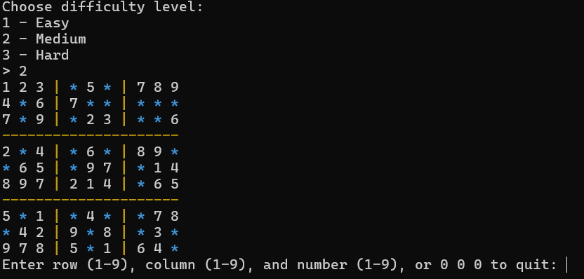

# Sudoku Generator and Solver in C++

This project is a simple console-based Sudoku puzzle generator and solver written in C++. 

## How It Works

1. **Board Generation**  
   A 9x9 grid is filled using backtracking to create a valid Sudoku solution.

2. **Puzzle Creation**  
   A selected number of cells are cleared depending on the difficulty:
   - Easy: 20 empty cells
   - Medium: 30 empty cells
   - Hard: 40 empty cells

3. **Interactive Play**  
   The player inputs numbers into the puzzle. The game checks for:
   - Valid range
   - Attempting to change original numbers
   - Violations of Sudoku rules

4. **Color Output**  
   - Pre-filled cells are white  
   - Empty cells are cyan `*`  
   - User input is shown in green  
   - Errors are displayed in red